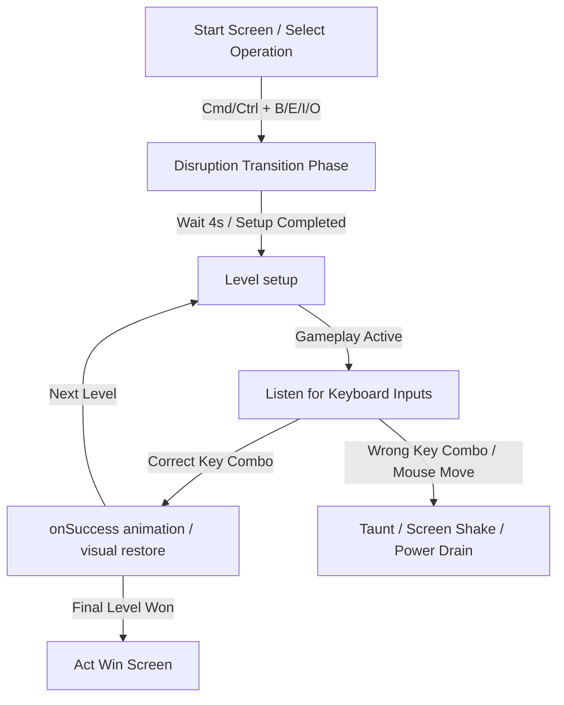

# Ghost in Your Browser — Gameplay & Mechanics Guide

This document provides a highly detailed, agent-friendly breakdown of all **Acts**, **Levels**, **Ghost States**, and **Browser UI Transitions** in the game. It is designed to help developer agents and human programmers understand how visual state changes coordinate with keyboard shortcut inputs.

---

## Game Loop Architecture

### Key Parameters & Global State
*   `window.__isActTransition`: Flag set to `true` during the 4-second disruption phase. Prevents user inputs from triggering gameplay checks.
*   `state.isAnimating`: Blocks key capture while transitional animations (e.g. page scrolls, window slides) are active.
*   `state.power`: Starts at `100` and drains linearly based on level count on each correct answer.

---

## Act 1: Browser Basics

Focuses on standard browser actions. Uses default tabs and a simulated article viewport.

### Level 1: `new_tab` (Open a new tab)
*   **Shortcut**: `⌘ + T` (macOS) / `Ctrl + T` (Windows)
*   **Ghost Behavior**: Hidden initially. Placed on top of the tab strip.
*   **Browser Action**: Renders standard mock browser window.
*   **onSuccess**: Ghost is pushed off the tab strip, and a new tab slides in.

### Level 2: `close_tab` (Close the current tab)
*   **Shortcut**: `⌘ + W` (macOS) / `Ctrl + W` (Windows)
*   **Ghost Behavior**: Nestles inside the tab element.
*   **Browser Action**: Closes the active tab with a collapse animation.
*   **onSuccess**: Tab shatters visually, and the ghost panics/flees.

### Level 3: `reload` (Reload the page)
*   **Shortcut**: `⌘ + R` (macOS) / `Ctrl + R` (Windows)
*   **Ghost Behavior**: Projects static noise onto the content viewport.
*   **Browser Action**: Viewport is overlayed with static scanlines.
*   **onSuccess**: A vertical scanline swipe clears the static overlay back to normal.

### Level 4: `find` (Find in page)
*   **Shortcut**: `⌘ + F` (macOS) / `Ctrl + F` (Windows)
*   **Ghost Behavior**: Sits directly on the browser search/find bar.
*   **Browser Action**: Slides out the find/search panel with "GHOST" text.
*   **onSuccess**: Ghost plays hit animation and find bar disappears.

### Level 5: `scroll_down` (Scroll down a page)
*   **Shortcut**: `Space`
*   **Ghost Behavior**: Sits below the page fold (off-screen).
*   **Browser Action**: Viewport content scroll height is doubled.
*   **onSuccess**: Viewport scrolls down smoothly to reveal the bottom content and the ghost.

### Level 6: `address_bar` (Focus the address bar)
*   **Shortcut**: `⌘ + L` (macOS) / `Ctrl + L` (Windows)
*   **Ghost Behavior**: Scrambles the characters in the URL address bar.
*   **Browser Action**: Text in the URL field glitches dynamically.
*   **onSuccess**: URL returns to normal and glows purple (focused state).

---

## Act 2: Tab Warfare

Manipulates multiple tabs in the tab strip.

### Level 1: `new_tab`
*   **Shortcut**: `⌘ + T` (macOS) / `Ctrl + T` (Windows)
*   **Ghost Behavior**: Sits on the active tab.

### Level 2: `close_tab`
*   **Shortcut**: `⌘ + W` (macOS) / `Ctrl + W` (Windows)
*   **Ghost Behavior**: Moves onto a newly infected tab.
*   **Tab Disruption**: After `1100ms`, the ghost leaps to tab index `1` to disrupt gameplay during transition.

### Level 3: `next_tab` (Next Tab)
*   **Shortcut**: `Ctrl + Tab` or `⌘ + Shift + ]` (macOS) / `Ctrl + PageDown` (Windows)
*   **Ghost Behavior**: Nestles on the tab immediately to the right.
*   **Browser Action**: Highlights the next tab rightward.

### Level 4: `prev_tab` (Previous Tab)
*   **Shortcut**: `Ctrl + Shift + Tab` or `⌘ + Shift + [` (macOS) / `Ctrl + PageUp` (Windows)
*   **Ghost Behavior**: Nestles on the tab immediately to the left.
*   **Browser Action**: Highlights the previous tab leftward.

### Level 5: `reopen_tab` (Reopen closed tab)
*   **Shortcut**: `⌘ + Shift + T` (macOS) / `Ctrl + Shift + T` (Windows)
*   **Ghost Behavior**: Fades away off-screen.
*   **Browser Action**: Active tab is closed initially. Reopening restores the tab strip.

### Level 6: `jump_tab` (Jump to specific tab)
*   **Shortcut**: `⌘ + 1-8` (macOS) / `Ctrl + 1-8` (Windows) (depends on which tab the ghost is nesting)
*   **Ghost Behavior**: Nestles on a random index (e.g. index 4) in the tab bar.
*   **Anti-Cheat**: If the user tries to navigate via standard left/right commands, the ghost jumps to another random tab and scolds the player.

---

## Act 3: Navigation & Windows

Controls history navigation and browser window scaling.

### Level 1: `back` (Go back in history)
*   **Shortcut**: `⌘ + [` or `⌘ + LeftArrow` (macOS) / `Alt + LeftArrow` (Windows)
*   **Ghost Behavior**: Sits on the back arrow button in the toolbar.
*   **Browser Action**: The back arrow glows.
*   **onSuccess**: Back page slides in smoothly from the left.

### Level 2: `forward` (Go forward in history)
*   **Shortcut**: `⌘ + ]` or `⌘ + RightArrow` (macOS) / `Alt + RightArrow` (Windows)
*   **Ghost Behavior**: Sits on the forward arrow button.
*   **Browser Action**: The forward arrow glows. 
*   **onSuccess**: Moves forward to the previous page.

### Level 3: `new_window` (Open a new window)
*   **Shortcut**: `⌘ + N` (macOS) / `Ctrl + N` (Windows)
*   **Ghost Behavior**: Starts at the titlebar, then after `1000ms`, floats diagonally off-screen top-right (`left: 100% + 150px`, `top: -150px`) and fades out.
*   **onSuccess**: Current browser slides out to the left, and a "new window" (Ghostgle) slides in from the right. Ghost reappears in the center, then hops to the active tab after `1500ms`.

### Level 4: `incognito` (Open incognito window)
*   **Shortcut**: `⌘ + Shift + N` (macOS) / `Ctrl + Shift + N` (Windows)
*   **Ghost Behavior**: Centered in the browser viewport.
*   **onSuccess**: Screen shifts to dark incognito theme. The ghost is trapped and shivers inside a dashed containment zone.

### Level 5: `close_window` (Close browser window)
*   **Shortcut**: `⌘ + Shift + W` (macOS) / `Ctrl + Shift + W` (Windows)
*   **Ghost Behavior**: Shivers in the center of the dark incognito zone.
*   **onSuccess**: The incognito window fades/shatters, restoring the standard window.

---

## Act 4: Page Mastery

Advanced page adjustments and viewport coordinate manipulation.

### Level 1: `scroll_up` (Scroll up a page)
*   **Shortcut**: `Shift + Space`
*   **Ghost Behavior**: Ascends above the screen header (`top: -400px`) during the 4.0-second start transition.
*   **Browser Action**: 
    *   During transition, sets layout to `wrapSelectPageHTML()` (Select Operation, `scrollTop = 0`).
    *   Once gameplay starts, swaps to `getSystemEventLogHTML('trace', true, true)` (Event Log at top, Select Operation at bottom) and automatically scrolls to the bottom (`scrollTop = 99999`).
*   **onSuccess**: Viewport scrolls back to top (`scrollTop = 0`), revealing the ghost nesting on the Event Log header.

### Level 2: `find_next` (Jump to next Find match)
*   **Shortcut**: `Enter` (macOS/Windows with Find Bar open)
*   **Ghost Behavior**: Sits on the second highlighted match (`trace-2`) in yellow.
*   **Browser Action**: The find bar highlights `trace-1` in purple (active match) and `trace-2` in yellow (next match).
*   **onSuccess**: Active selection shifts, swapping the highlight colors (purple on `trace-2`, yellow on `trace-1`).

### Level 3: `hard_reload` (Force reload / Clear Cache)
*   **Shortcut**: `⌘ + Shift + R` (macOS) / `Ctrl + F5` or `Ctrl + Shift + R` (Windows)
*   **Ghost Behavior**: Moves onto the reload icon.
*   **onSuccess**: Triggers an inverted-color screen-wipe flash.

### Level 4: `stop_load` (Stop page loading)
*   **Shortcut**: `Escape`
*   **Ghost Behavior**: Sits on an infinite loading spinner.
*   **onSuccess**: Page load halts, displaying the diagnostics network node map.

### Level 5: `zoom_in` (Zoom page view in)
*   **Shortcut**: `⌘ + =` (macOS) / `Ctrl + =` (Windows)
*   **Ghost Behavior**: Starts extremely tiny (`width: 6px`, `height: 6px`) in a scaled-down viewport (`scale(0.15)`).
*   **onSuccess**: Viewport zooms in (`scale(1.5)`), enlarging the ghost (`width: 54px`, `height: 54px`). It then scales up to `scale(4)` to prepare for the zoom out phase.

### Level 6: `zoom_out` (Zoom page view out)
*   **Shortcut**: `⌘ + -` (macOS) / `Ctrl + -` (Windows)
*   **Ghost Behavior**: Enormous size (`width: 144px`, `height: 144px`) in a zoomed viewport (`scale(4)`).
*   **onSuccess**: Viewport zooms out (`scale(0.3)`), shrinking the ghost down (`width: 12px`, `height: 12px`).

### Level 7: `zoom_reset` (Reset page zoom to 100%)
*   **Shortcut**: `⌘ + 0` (macOS) / `Ctrl + 0` (Windows)
*   **Ghost Behavior**: Microscopic size in a shrunk viewport (`scale(0.3)`).
*   **onSuccess**: Viewport scales back to normal (`scale(1)`), restoring the ghost to standard dimensions (`36px`).

### Level 8: `bookmark` (Add page to bookmarks)
*   **Shortcut**: `⌘ + D` (macOS) / `Ctrl + D` (Windows)
*   **Ghost Behavior**: Sits on the bookmark star icon.
*   **onSuccess**: Ghost flees.

### Level 9: `print` (Print current page)
*   **Shortcut**: `⌘ + P` (macOS) / `Ctrl + P` (Windows)
*   **Ghost Behavior**: Centered in the viewport.
*   **onSuccess**: Flashes bright white. Text nodes inside the viewport fall down the page with a gravity rotate animation. The ghost is permanently deleted from browser memory, transitioning to the Victory Screen.
